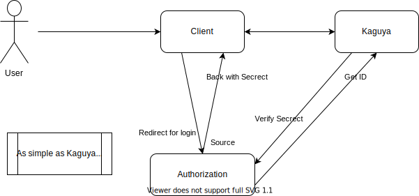

# Yaeverse EastAuth

A simple authentication server.


## Authorized  Flow

1. User login with username and password.
2. Server verify the username and password.
3. Server generate a token and return to the user.
4. User use the token to access the resources.



## Deploy

Deploy the project to the server.

### Requirements

Here are the requirements to deploy the project.

- python 3.6+
- pip

### Install

Follow the steps below to install the project.

```shell
pip install -r requirements.txt
```

### Development

Run the following command to start the development server.

```shell
flask run
```

## Default Users

| Username | Password |
| -------- | -------- |
| admin    | admin    |
| user     | user     |

## License

The software licensed under Mozilla Public License Version 2.0

[LICENSE](LICENSE)
